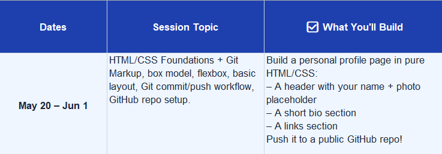
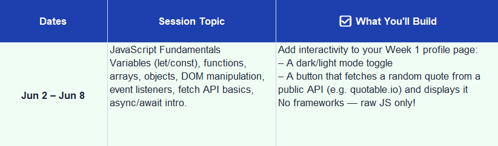

# DevLabs 2.0

## Steps to Follow for the DevLabs Git & Github Session

### Clone the Repo

```bash
git clone https://github.com/Jaswanth-Kumar-2007/DevLabs_2.0.git
```

### Create the Branch with your Name

```bash
git branch {Your_Name}
```

### Change the Main Branch to your Branch

```bash
git checkout {Your_Name}
```

### Add your Changes

```bash
git add .
```

### Commit your Changes in Code

```bash
git commit -m {What Change you Done}
```

### Push the Changes in the Code When you Update

```bash
git push -u origin  {Your_Name}
```

## Week 1



---

## Resources for Week 1

Git and GitHub Resources :

- [Git Explained in 100 seconds - Fireship](https://youtu.be/hwP7WQkmECE?si=rXsvw86_89VDvcPx)

- [Git it ? How to use Git and Github](https://youtu.be/HkdAHXoRtos?si=4SGGydlHQz9NdO9t)

HTML , CSS Resources :

- [MDN Web Docs HTML](https://developer.mozilla.org/en-US/docs/Web/HTML)

- [HTML Cheatsheet](https://developer.mozilla.org/en-US/docs/Web/HTML/Guides/Cheatsheet)

- [MDN Web Docs CSS](https://developer.mozilla.org/en-US/docs/Web/CSS)

- [Odin Project HTML & CSS Course](https://www.theodinproject.com/paths/full-stack-javascript/courses/intermediate-html-and-css)

- [HTML & CSS for Absolute Begineers - Kevin Powell](https://youtube.com/playlist?list=PL4-IK0AVhVjOJs_UjdQeyEZ_cmEV3uJvx&si=O-GPiMu2mKizZyd9)

- [FlexBox - Kevin Powell](https://youtu.be/u044iM9xsWU?si=TpGMDIlv7j85ZD6F)

- [FlexBox in 10 Minutes - Bro Code](https://youtu.be/GteJWhCikCk?si=9_QkPi4LD0RZKzAQ)

- [CSS Grid - Kevin Powell](https://youtu.be/rg7Fvvl3taU?si=CInjLRIXJRibITJz)

- [CSS Grid - Crash Course](https://youtu.be/0xMQfnTU6oo?si=ap_TKzqQ1rANQ7Nb)

- [CSS Grid Generator](https://cssgridgenerator.io/)

### HTML Basic Structure

```html
<!DOCTYPE html>
<html lang="en">
<head>
    <meta charset="UTF-8">
    <meta name="viewport" content="width=device-width, initial-scale=1.0">
    <title>Document</title>
</head>
<body>
    
</body>
</html>
```

Source for You By Me :

- [Introduction to Git and Github](https://github.com/Jaswanth-Kumar-2007/Introduction-to-Git-and-GitHub/blob/main/Git%26GitHub.md)

- [HTML W3 Schools](https://www.w3schools.com/html/default.asp)

- [CSS W3 Schools](https://www.w3schools.com/css/default.asp)

### Prerequisites for Web Developer

#### Code Editor

VS Code - [VS Code Download](https://code.visualstudio.com/download)

CodePen (For HTML , CSS , JS) - [CodePen Online Editor](https://codepen.io/pen/)

#### Live Server

- Open Extension Panel


- Search for Live Server


- Verify the Installation


- Launch Live Server


- Live Preview in Browser


- Image Credits by Geeks for Geeks

## Week 2



---

## Resources for Week 2

JS Resources :

- [Modern JavaScript Tutorial](https://javascript.info/)

- [Javascript in 100 seconds - Fireship](https://youtu.be/DHjqpvDnNGE?si=nsK5hAiQHYLo0_xs)

- [Learn JavaScript - Freecodecamp](https://youtu.be/PkZNo7MFNFg?si=ESXMszkh6HR8Mc4q)

- [Javascript Crash Course - Traversy Media](https://youtu.be/hdI2bqOjy3c?si=bCEUtdec43AyARuC)

Source for You By Me :

- [JavaScript W3 Schools](https://www.w3schools.com/js/default.asp)

## Week 3

Schedule Will Update Soon .....

---

## Resources for Week 3

Release Soon ...

## Week 4

Schedule Will Update Soon .....

---

## Resources for Week 4

Release Soon ...

## Contributions

### Contribute Here to Get a Place Here ! 🥰

<a href="https://github.com/Jaswanth-Kumar-2007/DevLabs_2.0/graphs/contributors">
  
</a>

---
